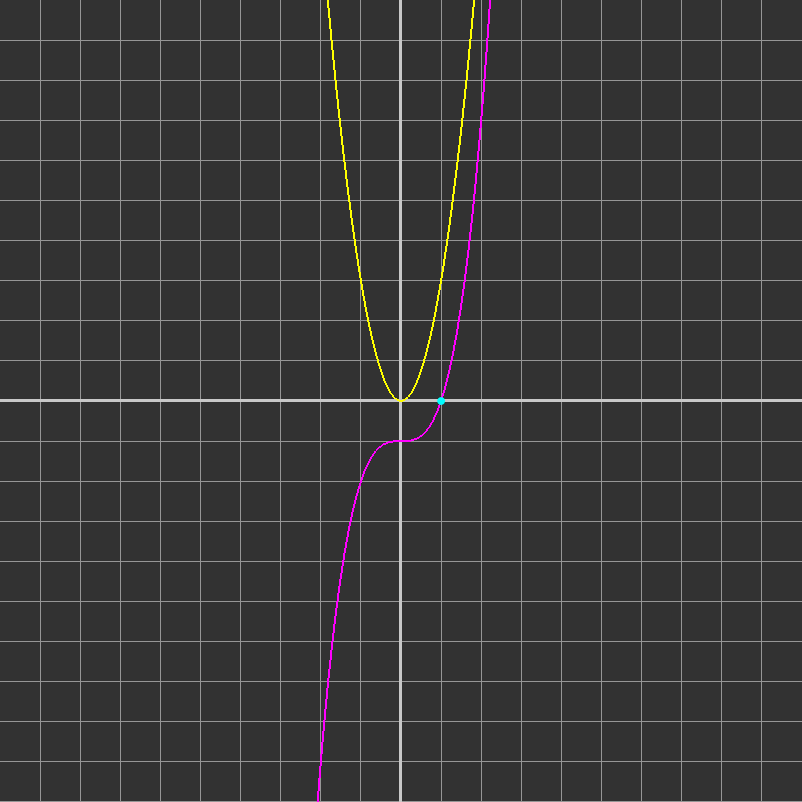
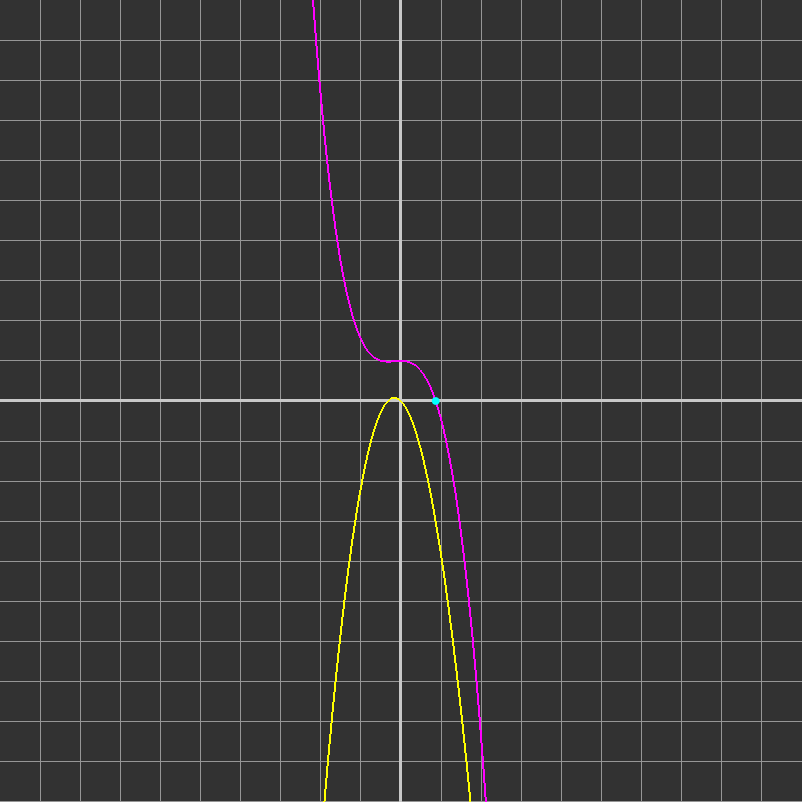
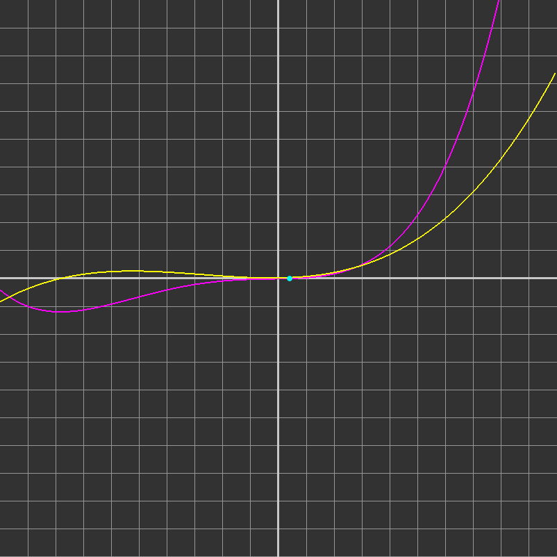

# Vastaukset
# Eetu Horttanainen
Funktio: f(x) = x^3 - 1 kun x0 = 0.5

Vastaus: 1.000000

Funktio: f(x) = cos(x)-x^3 = 0 kun x0 = 0.5.

Vastaus: 0.865474

Funktio: f(x) = (x^4 + 11x^3 + 8x^2 + 20*x - 10) / 1000 minimi

Vastaus: 0.399699

